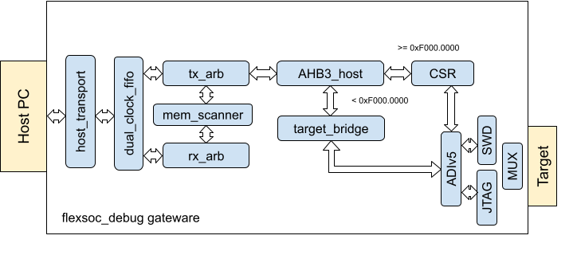

# flexsoc-debug
JTAG/SWD debugger implemented via FPGA

## Architecture

## Dependencies
  `sudo apt install libftdi1-dev verilator cmake python3 python3-pip`
- fusesoc  
   `pip3 install --upgrade --user fusesoc`
- vivado  
  `https://www.xilinx.com/support/download.html`
