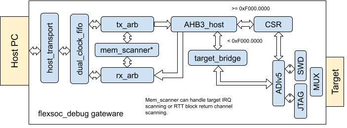

# flexsoc-debug
JTAG/SWD debugger implemented via FPGA

## Architecture

## Dependencies
  `sudo apt install libftdi1-dev verilator cmake python3 python3-pip`
- fusesoc  
   `pip3 install --upgrade --user fusesoc`
- vivado  
  `https://www.xilinx.com/support/download.html`

## Goals
- [x] Direct DP/AP access api
- [x] Support for JTAG/SWD protocols
- [x] Transparent bridge between AHB3 and remote target
- [ ] Renode support
- [ ] IRQ scanning/forwarding from target
- [x] 200MHz PHY fmax (not tested)

## Compiling
`git clone https://github.com/tinylabs/flexsoc-debug.git`  
`cd flexsoc-debug`  
`mkdir build; cd build`  
`cmake ../`  
`make`  
`make check` Run unit tests using verilator (takes a while)  
`make arty`  Synthesize for Digilent Arty A35-T FPGA board  
